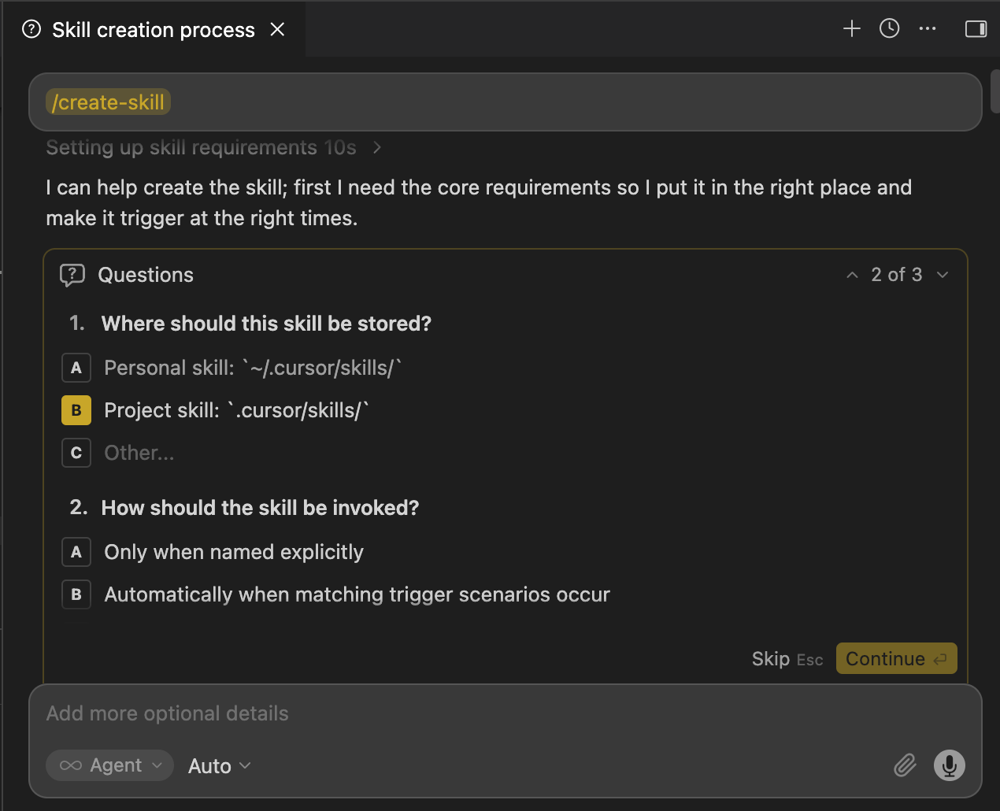

# Internode CLI

Agent-native CLI for Internode Organizational Intelligence. Designed for AI agents (Claude Code, Cursor, etc.) to use as long-term memory.

## Install

```bash
curl -fsSL https://raw.githubusercontent.com/InternodeLabs/internode-cli/main/install.sh | sh
```

Or build from source:

```bash
cd cli
cargo build --release
# Binary: target/release/internode
```

## Download `SKILL.md`

If you want the agent skill file locally:

Copy the [SKILL.md](http://SKILL.md) from this repository and place it in your coding agent as a reference or skill.

You can also download it using cURL:

```bash
curl -fsSL https://raw.githubusercontent.com/InternodeLabs/internode-cli/main/SKILL.md -o SKILL.md
```

Each IDE or Coding agent may use skills differently. Here are som examples of where to place and/or reference the Internode skill (typically in its own `.../internode/SKILL.md` path)

- Cursor: [https://cursor.com/docs/skills#skill-directories](https://cursor.com/docs/skills#skill-directories)
- Claude: [https://support.claude.com/en/articles/12512180-use-skills-in-claude](https://support.claude.com/en/articles/12512180-use-skills-in-claude)
- Codex: [https://developers.openai.com/codex/skills](https://developers.openai.com/codex/skills)

Some agents allow customizations like adding `disable-model-invocation: true` to scope skill invocation. You can further customize Internode skill invokation via your `AGENTS.md` (or similar) file. For example: Adding `- load internode skill when working with ...`. Though we have seen the agents do quite well making that decision on their own.

### Use Your Agent to Add This Skill

Most agents have skills built in to add skills easily. See the Cursor skill to add a skill example below.



## Authenticate CLI

_(Not yet publicly available. Email contact@internode.ai for access.)_

1. Log in to [app.internode.ai](https://app.internode.ai)
2. Go to **Settings > CLI API Key**
3. Click **Generate Key** and copy it
4. Run:

```bash
internode configure ink_your_api_key_here
```

1. Verify:

```bash
internode auth status
```

## Permissions Model

| Action                                                                       | Allowed                       |
| ---------------------------------------------------------------------------- | ----------------------------- |
| Read / list all entities                                                     | Yes                           |
| Diagnose V2 reconciliation noise (uncapped edge counts)                      | Yes                           |
| Update task scalar properties                                                | Yes                           |
| Update topic / sub-topic / decision / intent scalar properties               | Yes                           |
| Create projects                                                              | Yes                           |
| Create other entities                                                        | No                            |
| Re-parent sub-topics, link/unlink decision edges, merge roots                | Yes (subject to V3 invariant) |
| Soft-archive (sets `deleted=true`) topics / sub-topics / decisions / intents | Yes                           |
| Hard delete any entity                                                       | No                            |

## Calling CLI Commands Directly

All commands output structured JSON on stdout. Diagnostics go to stderr.

### Topics

```bash
internode topics list
internode topics list --search "authentication" --category 2 --limit 20
internode topics inspect <topic_id>                                  # uncapped relationship dump
internode topics create  --title "..." --category 5 --data-date 2025-03-14  # net-new, optionally backdated
internode topics update  <topic_id> --title "..." --category 5
internode topics update  <topic_id> --title "..." --data-date 2025-03-14  # stamp the new version with a historical date
internode topics archive <topic_id>                                  # soft-delete
internode topics merge   <source_topic_id> --into <target_topic_id>  # absorb every sub-topic, then archive source
```

### Sub-topics

```bash
internode subtopics list
internode subtopics list --type Idea --topic <topic_id>
internode subtopics list --type Problem --limit 10
internode subtopics inspect <sub_topic_id>
internode subtopics move    <sub_topic_id> --to-topic <target_topic_id>
internode subtopics archive <sub_topic_id>
internode subtopics update  <sub_topic_id> --conclusion "..." --data-date 2025-03-14  # revise with a historical date
```

> **Historical dates (`--data-date`):** every `update` command above accepts an
> optional `--data-date <ISO-8601>` (e.g. `2025-03-14` or `2025-03-14T10:00:00Z`).
> It stamps the newly-appended version with that historical date instead of
> "now", preserving the true timeline. Setting it inserts the version into the
> chain at the right point by date. You may pass `--data-date` alone (no content
> change) to append a date-corrected version. An unparseable value returns 422.
> For `split` plans, add a `"data_date"` key inside any `new_topic` /
> `new_decision` / `new_intent` object to backdate the entity it creates.

### Tasks

```bash
internode tasks list
internode tasks list --team <team_id> --status <status_id> --priority high
internode tasks list --topic <topic_id> --intent <intent_id>
internode tasks list --topic-category "Technology & Engineering"
internode tasks update <id> --priority medium --assignee user@example.com
internode tasks update <id> --team <team_id> --project <project_id>
internode tasks update <id> --status <status_id> --due-date 2026-04-01
internode tasks update <id> --user-notes "Blocked on review" --type action_item
internode tasks update <id> --data-date 2025-03-14          # stamp the new version with a historical date
internode tasks create --title "..." --team <team_id> --data-date 2025-03-14  # net-new, optionally backdated

# Per-version history fixes (append-only chain): re-date or remove one bad version, then auto-repair
internode tasks version set-date <version_id> --data-date 2025-03-14
internode tasks version delete   <version_id>
```

### Decisions

```bash
internode decisions list
internode decisions list --search "pricing model" --limit 10
internode decisions inspect <decision_id>
internode decisions create  --title "..." --status "approved" --data-date 2025-03-14  # net-new (link edges after)
internode decisions update  <decision_id> --title "..." --rationale "..." --status "approved"
internode decisions update  <decision_id> --data-date 2025-03-14  # stamp the new version with a historical date
internode decisions archive <decision_id>
internode decisions merge   <source_decision_id> --into <target_decision_id>

# Per-version history fixes (append-only chain): re-date or remove one bad version, then auto-repair
internode decisions version set-date <version_id> --data-date 2025-03-14
internode decisions version delete   <version_id>

# Edge link/unlink — pass exactly one of --sub-topic, --task, --intent
internode decisions link   <decision_id> --sub-topic <sid> --type RATIFIES
internode decisions link   <decision_id> --task <task_id> --type SPAWNS
internode decisions link   <decision_id> --intent <intent_id>

internode decisions unlink <decision_id> --sub-topic <sid>
internode decisions unlink <decision_id> --intent <intent_id>
```

> **Invariant:** every live decision must keep ≥1 sub-topic edge AND ≥1 intent edge. `unlink` calls that would violate this return HTTP 422 — add a replacement edge or `archive` the decision instead.

### Intents

```bash
internode intents list
internode intents list --limit 50
internode intents inspect <intent_id>
internode intents create  --title "..." --signal "ARR" --signal "growth" --data-date 2025-03-14  # net-new, optionally backdated
internode intents update  <intent_id> --title "..." --signals "ARR,growth"
internode intents update  <intent_id> --data-date 2025-03-14  # stamp the new version with a historical date
internode intents archive <intent_id>
internode intents merge   <source_intent_id> --into <target_intent_id>
internode intents set-scope    <intent_id> "team-wide" --data-date 2025-03-14
internode intents add-signal   <intent_id> --signal "churn" --data-date 2025-03-14
internode intents remove-signal <intent_id> --signal "churn" --data-date 2025-03-14
internode intents consolidate --into <target_intent_id> --source <src1> --source <src2> --data-date 2025-03-14

# Per-version history fixes (append-only chain): re-date or remove one bad version, then auto-repair
internode intents version set-date <version_id> --data-date 2025-03-14
internode intents version delete   <version_id>
```

> Every intent op that writes a new version (`update`, `set-scope`, `add-signal`,
> `remove-signal`, `consolidate`) accepts `--data-date <ISO-8601>` to stamp that
> version with a historical date instead of "now". `version set-date` / `version
> delete` correct a single already-written version in place (decisions/intents/tasks).

### Diagnose V2 reconciliation noise

```bash
internode diagnose decisions --by sub_topics --top 20
internode diagnose decisions --by tasks --min-edges 10
internode diagnose topics    --by sub_topics --top 30
internode diagnose subtopics --min-edges 5
internode diagnose intents   --min-edges 10
```

Diagnostic output is uncapped — each item carries the **real** edge count so you can see noise that `entity get` (capped at 4) hides. Combine with `<entity> inspect <id>` for a full edge dump on the worst offenders.

#### Cleanup workflow

```text
diagnose  →  inspect  →  mutate  →  diagnose
```

| Symptom                                           | Right primitive                                                                    |
| ------------------------------------------------- | ---------------------------------------------------------------------------------- |
| Sub-topic on the wrong topic root                 | `subtopics move <sub_id> --to-topic <correct_topic_id>`                            |
| Two `OITopic` roots about the same subject        | `topics merge <duplicate_id> --into <canonical_id>`                                |
| Two `OIIntent` roots about the same goal          | `intents merge <duplicate_id> --into <canonical_id>`                               |
| Two `OIDecision` roots about the same choice      | `decisions merge <duplicate_id> --into <canonical_id>`                             |
| Decision↔sub-topic linked with the wrong rel-type | `decisions unlink <did> --sub-topic <stid> --type WRONG` → `link ... --type RIGHT` |
| Decision linked to an unrelated sub-topic         | `decisions unlink <did> --sub-topic <stid>` (422 if it's the last one)             |
| Decision is over-linked beyond saving             | `decisions archive <did>`                                                          |
| Sub-topic conclusion text is wrong                | `subtopics archive <sub_id>` (versions are append-only — never edit in place)      |

### Entity Details

Retrieve full knowledge molecules (tasks, sub-topics, decisions) or property details (other entity types). Accepts up to 20 IDs.

```bash
internode entity get <id>
internode entity get <id1> <id2> <id3>
```

### Teams / Projects / Statuses

```bash
internode teams list
internode teams create --name "Platform" --created-date 2025-01-01     # optionally backdated
internode teams set-created-date <team_id> --created-date 2025-01-01   # fix an existing team

internode projects list --team <team_id>
internode projects create --name "v2" --team <team_id>
internode projects create --name "v2" --team <team_id> --key PRJ --description "Version 2" --created-date 2025-01-01
internode projects set-created-date <project_id> --created-date 2025-01-01

internode statuses list --team <team_id>
internode statuses create --team <team_id> --name "In Review" --category in_progress --created-date 2025-01-01
internode statuses set-created-date <status_id> --created-date 2025-01-01
```

> Root entities (teams, projects, statuses) are not versioned — their history is the single
> `created_at` timestamp. `--created-date` sets it at creation; `set-created-date` corrects it on
> an existing root (e.g. one a cleanup pass stamped with today's date).

### Search

```bash
internode search "authentication architecture"
```

### Context (LLM-optimized)

```bash
internode context --max-tokens 4000
```

### Changes (incremental change feed)

Returns which OI roots changed since a cutoff, as `{id, type, change, at, content_hash}` where `change` is `created | updated | archived`. Omit `--since` for a full baseline (every live root + its content hash) so a fresh consumer can seed its state in one call. Use this — plus the `content_hash` now returned on `list` items — to detect exactly what changed instead of downloading the whole graph.

```bash
internode changes
internode changes --since 2025-03-14T10:00:00Z
internode changes --since 2025-03-14 --types OITopic,OIIntent
```

## Configuration

Config file: `~/.config/internode/config.toml`

```toml
api_url = "https://agents.api.internode.ai"
api_key = "ink_..."
```

## Output Format

All commands return JSON envelopes:

```json
{"ok": true, "data": { ... }}
```

Errors:

```json
{ "ok": false, "error": { "code": "AUTH_ERROR", "message": "..." } }
```

## Exit Codes

| Code | Meaning       |
| ---- | ------------- |
| 0    | Success       |
| 1    | Bad input     |
| 2    | Auth error    |
| 3    | Server error  |
| 4    | Network error |

## Release

GitHub Actions cross-compiles on tag push:

- Linux AMD64
- macOS ARM64 (Apple Silicon)
- Windows x64
